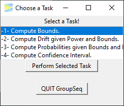

<!-- README.md is generated from README.Rmd. Please edit that file -->
<!-- badges: start -->

[](https://cran.r-project.org/package=GroupSeq)
[](https://github.com/rpahl/GroupSeq/actions)
[](https://CRAN.R-project.org/package=GroupSeq)
[](https://cran.r-project.org/package=GroupSeq)
[](https://www.r-pkg.org:443/pkg/GroupSeq)
[](https://cran.r-project.org/package=GroupSeq)
[](https://cran.r-project.org/package=GroupSeq)

<!-- badges: end -->

# GroupSeq 

GroupSeq computes probabilities related to group sequential designs for
normally distributed test statistics. It enables to derive critical
boundaries, power, drift, and confidence intervals of such designs and
supports the alpha spending approach by Lan-DeMets.

### Installation

``` r
# Install release version from CRAN
install.packages("GroupSeq")

# Install development version from GitHub
devtools::install_github("rpahl/GroupSeq")
```

### Usage

Load the library to start the graphical user interface.

``` r
library("GroupSeq")
```


