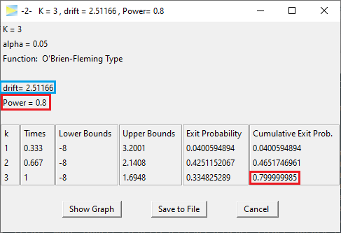
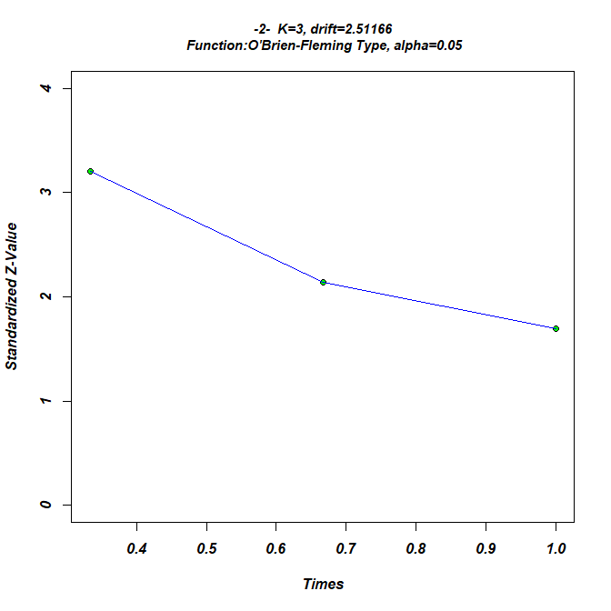
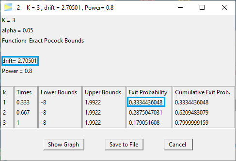

```{r knitr-setup, include = FALSE}
library(knitr)
knitr::opts_chunk$set(
  comment = "#",
  prompt = F,
  tidy = FALSE,
  cache = FALSE,
  collapse = T,
  echo = FALSE,
  dpi = 300,
  fig.width = 5, fig.height = 5
)

options(width = 100L)
```

If you haven't seen the vignette 
[-1- Compute Bounds](https://rpahl.github.io/GroupSeq/articles/1-compute-bounds-H0.html),
it is recommended to visit this one first.

The option -2- menu initially looks as follows.

```{r, out.width = "35%", echo = FALSE}
include_graphics("figures/task2-menu.png")
```

<br>
For a start lets set `K=3` stages and `CALCULATE`.

```{r, out.width = c("55%", "40%"), echo = FALSE,fig.show="hold"}


```

<br>
The design maintains the power of 80%. The second to last column
provides the `Exit Probability` for each stage. As is typical for 
O'Brien-Fleming designs, the probability to abort the study is very low 
(here 4%) even under `H1`. Then on the second stage, it's 42% and cumulative 
almost a 50% chance of having the study aborted by then and finally in one
third of the cases the effect is detected at the last stage while in the 
remaining 20% of cases `H0` will be accepted and the effect stays undetected.
These probabilities are all valid if the true drift (i.e. true standardized 
effect size) is 2.51.

Next lets see the required drift if we use a Pocock design.

```{r, out.width = "50%"}

```

Apparently, to achieve a power of 80%, this design requires an effect of 2.71,
which is 8% higher than that of the O'Brien-Fleming designs.
Comparing the power of both designs for a specific drift, is discussed in
[-3- Compute Probabilities given Bounds and Drift](https://rpahl.github.io/GroupSeq/articles/3-compute-bounds-H1.html).

With the Pocock design on the other hand you will be able to abort the study
at the first interim look in about 33% of the cases, so if you are optimistic
about your expected effect, the Pocock design might be the better choice as
it will result in lower required samples on average and faster study conclusion.

