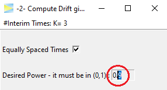

```{r knitr-setup, include = FALSE}
library(knitr)
knitr::opts_chunk$set(
  comment = "#",
  prompt = F,
  tidy = FALSE,
  cache = FALSE,
  collapse = T,
  echo = FALSE,
  dpi = 300,
  fig.width = 5, fig.height = 5
)

options(width = 100L)
```

If you haven't seen the vignette 
[-1- Compute Bounds](https://rpahl.github.io/GroupSeq/articles/1-compute-bounds-H0.html),
it is recommended to visit this one first.

The option -2- menu initially looks as follows.

```{r, out.width = "35%", echo = FALSE}
include_graphics("figures/task2-menu.png")
```

### O'Brien-Fleming 3-stage design

<br>
For a start lets set `K=3` stages and `CALCULATE`.

```{r, out.width = c("55%", "40%"), echo = FALSE,fig.show="hold"}
include_graphics("figures/task2-3stage-OBF-result.png")

```

<br>
The design maintains the power of 80%. The second to last column
provides the `Exit Probability` for each stage. As is typical for 
O'Brien-Fleming designs, the probability to abort the study is very low 
(here 4%) even under `H1`. Then on the second stage, it's 42% and cumulative 
almost a 50% chance of having the study aborted by then and finally in one
third of the cases the effect is detected at the last stage while in the 
remaining 20% of cases `H0` will be accepted and the effect stays undetected.
These probabilities are all valid if the true drift (i.e. true standardized 
effect size) is 2.51.

### Pocock 3-stage design

Next lets see the required drift if we use a Pocock design.

```{r, out.width = "50%"}
include_graphics("figures/task2-3stage-Pocock-result.png")
```

Apparently, to achieve a power of 80%, this design requires an effect of 2.71,
which is 8% higher than that of the O'Brien-Fleming designs.
Comparing the power of both designs for a specific drift, is discussed in
[-3- Compute Probabilities given Bounds and Drift](https://rpahl.github.io/GroupSeq/articles/3-compute-bounds-H1.html).

With the Pocock design on the other hand you will be able to abort the study
at the first interim look in about 33% of the cases, so if you are optimistic
about your expected effect, the Pocock design might be the better choice as
it will result in lower required samples on average and thereby 
a faster study conclusion.

To change the desired power, just edit the value in the input window.

```{r, out.width = "25%"}

```

<br>
If we re-`CALCULATE`, we get

```{r, out.width = "50%"}
include_graphics("figures/task2-3stage-Pocock-result-power90.png")
```

<br>
As expected the required drift has increased to now 3.16, but there is also
something interesting to the resulting exit probabilities as basically the 
10% increase in power was "added" to the first interim look, which now has a 
probability of 43% to succeed. Also the exit probability at the final stage
even has been decreased slightly. 

First of all, this is good news, of course, because it means that it has become
less likely that the full sample is required to come to a conclusion. 
Intuitively, this also makes sense, because a stronger effect indicated by
the higher drift (on average) will be detected earlier than a weaker effect.

### Manual bounds

In order to enable the computation of drift for arbitrary designs, you can
enter bounds manually.

```{r, out.width = "35%", echo = FALSE}
include_graphics("figures/task2-set-manual-bounds.png")
```

<br>
Hitting `CALCULATE` for the default bounds 1, 2, 3, we get

```{r, out.width = "50%"}
include_graphics("figures/task2-3stage-Pocock-result-manual-bounds.png")
```

<br>
This design maintains the specified power, if the drift was
3.355, but it does not maintain the 5% alpha level under 
`H0` (drift = 0).

To see this, check out the next vignette
[-3- Compute Probabilities given Bounds and Drift](https://rpahl.github.io/GroupSeq/articles/3-compute-bounds-H1.html)


