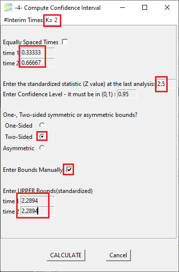

```{r knitr-setup, include = FALSE}
library(knitr)
knitr::opts_chunk$set(
  comment = "#",
  prompt = F,
  tidy = FALSE,
  cache = FALSE,
  collapse = T
)

options(width = 100L)
```

Let's assume you have planned a two-sided 3-stage Pocock design with 80% power.

```{r, out.width = "35%", echo = FALSE}

```

The resulting design requires a drift of about 3.

```{r, out.width = c("55%", "38%"), echo = FALSE,fig.show="hold"}


```

During the study you perform the interim analysis as planned when about 67% of
all samples were collected and obtain a standardized effect size of 2.5, exceeding
the critical bound (2.2894) so that you can abort the study and reject H0.

To compute the confidence interval at this point, open option -4- of GroupSeq and
enter the values as shown below.

```{r, out.width = "45%", echo = FALSE}

```

Hitting `CALCULATE` yields the following.

```{r, out.width = "50%", echo = FALSE}

```

So for this study, the resulting confidence interval of the standardized
effect is (0.30, 5.38). 

Depending on the underlying data distribution and applied
test statistic this will be "back-calculated" to obtain the confidence interval
for the value of interest (e.g. mean difference for some normally distributed 
data or difference in proportions of some binomially distributed data).

