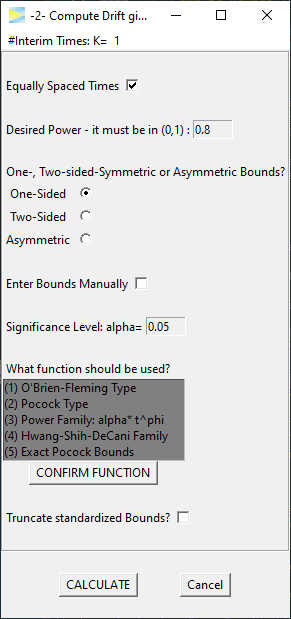
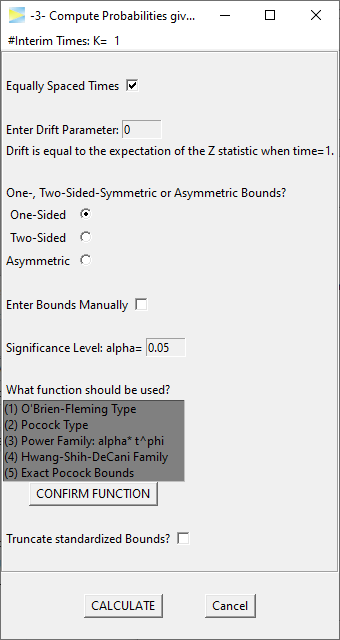
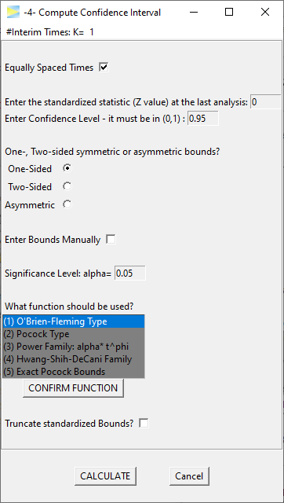

```{r knitr-setup, include = FALSE}
library(knitr)
library("ggplot2")

knitr::opts_chunk$set(
  comment = "#",
  prompt = F,
  tidy = FALSE,
  cache = FALSE,
  collapse = T,
  echo = FALSE,
  dpi = 300
)

okabe_palette <- c('orange' = "#E69F00",
                   'sky blue' = "#56B4E9",
                   'bluish green' = "#009E73",
                   'yellow' = "#F0E442",
                   'blue' = "#0072B2",
                   'vermillion' = "#D55E00",
                   'reddish purple' = "#CC79A7")

old <- options(width = 100L, digits = 10)
```

Group sequential designs in essence allow to lower the sample size of clinical
or other studies. To be clear - if a group sequentially designed study is
conducted until the final analysis, that is, without aborting at one
of the interim looks, the required sample will be larger compared to a simple
single stage study, because you have to "pay" for the added interim
analyses to prevent
[alpha inflation](https://en.wikipedia.org/wiki/Multiple_comparisons_problem).

But, from time to time, especially if the underlying effect is strong
(e.g. you have a very potent medicine),
you will abort the study early and this on average
leads to lower sample sizes, or in other words, the expected sample size of
group sequential designs is lower than the sample size of comparable studies
with just one final analysis.

If you want to get an intuitive understanding on how probabilities of group
sequential designs are calculated, please see the vignette
[Understanding group sequential designs](https://rpahl.github.io/GroupSeq/articles/understanding-gs-designs.html).

The GroupSeq package can be used to perform basic calculations related
to group sequential designs. At this point, the functionality is mainly
provided via a graphical user interface. The interface was designed such that
each calculation can be opened in separate windows allowing to compute
and compare arbitrary many designs in parallel.

The following section gives a brief overview of all the available options
with links to further details.

### GroupSeq menu

Loading the library opens the main GroupSeq window.

```{r, eval = FALSE, echo = TRUE}
library("GroupSeq")
```

```{r, out.width = "35%", echo = FALSE}
include_graphics("figures/menu-after-load.png")
```

<br>

The menu lists four possible tasks. To select a task, you have to select a row
and hit the `Perform Selected Task` button.
Each task opens in a new window and it's also possible to open
multiple windows of the same task in parallel.
For a detailed description of the respective task follow one of the links below:

#### [-1- Compute Bounds](https://rpahl.github.io/GroupSeq/articles/task-1-compute-bounds-H0.html)

Use this to compute the boundaries of group sequential designs under the null
hypothesis (`H0`), that is, under a given significance level alpha (usually 5%).

```{r, out.width = "25%", echo = FALSE}
include_graphics("figures/task1-menu.png")
```

* Computes group sequential bounds under the null hypothesis for given overall
  significance level.
* Bounds can be one- or two-sided or completely asymmetric.
* User chooses number of stages and some alpha spending function.


#### [-2- Compute Drift given Power and Bounds](https://rpahl.github.io/GroupSeq/articles/task-2-compute-drift.html)

Use this to compute the target effect size of a group sequential design,
which maintains a certain power (e.g. power = 80%).

```{r, out.width = "25%", echo = FALSE}

```

* Computes drift (i.e. standardized effect size) required to achieve desired power
  of a given group sequential design.
* The group sequential design is defined via alpha spending functions or custom
  critical bounds.
* Bounds can be one- or two-sided or completely asymmetric.
* User chooses number of stages.


#### [-3- Compute Probabilities given Bounds and Drift](https://rpahl.github.io/GroupSeq/articles/task-3-compute-bounds-H1.html)

Use this to compute the power of a group sequential design.

```{r, out.width = "25%", echo = FALSE}

```

* Computes power that is achieved by a group sequential design given some drift
  (i.e. standardized effect size).
* The group sequential design is defined via alpha spending functions or custom
  critical bounds.
* Bounds can be one- or two-sided or completely asymmetric.
* User chooses number of stages.


#### [-4- Compute Confidence Interval](https://rpahl.github.io/GroupSeq/articles/task-4-compute-CI.html)

Use this to compute the confidence intervals for the target outcome
at the final analysis, which can be the last stage as planned or at an earlier
stage exceeding the critical bounds and therefore stopping early.

```{r, out.width = "25%", echo = FALSE}

```

* Computes confidence interval at final analysis stage for given expected effect size.
* The group sequential design is defined via alpha spending functions or custom
  critical bounds.
* Bounds can be one- or two-sided or completely asymmetric.
* User chooses number of stages and confidence level.


To close the application and, with it, all open windows, just close the main
window or hit the `QUIT GroupSeq` button.


```{r, include = FALSE}
options(old)
```