```{r knitr-setup, include = FALSE}
library(knitr)
knitr::opts_chunk$set(
  comment = "#",
  prompt = F,
  tidy = FALSE,
  cache = FALSE,
  collapse = T,
  echo = FALSE,
  dpi = 300,
  fig.width = 5, fig.height = 5
)

old <- options(width = 100L, digits = 10)
```

The option -1- menu initially looks as follows.

```{r, out.width = "35%", echo = FALSE, fig.alt = "task-1-menu"}
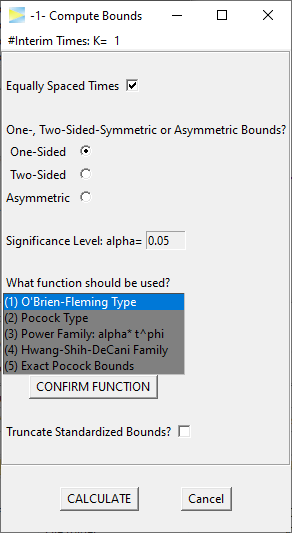
```

### Single stage

As a first example, let's hit the `CALCULATE` button, which should open a
new window with the following results.

```{r, out.width = "50%", fig.alt = "one-stage-result"}
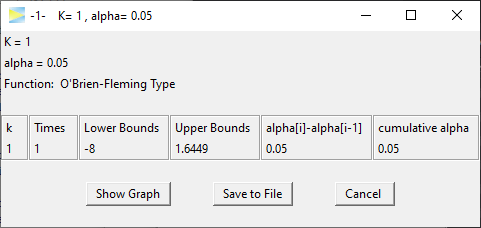
```

Since the number stages was set to $K = 1$, we just calculated one-sided
bounds for a simple 1-stage design, which is equivalent to

```{r, echo = TRUE}
alpha = 0.05
qnorm(1 - alpha)
```

### O'Brien-Fleming 3-stage design

To obtain a true group sequential design, we have to select $K > 1$ stages.
The number of stages is chosen at the top of the window.
Note that in GroupSeq this is called
`#Interim Times`, which means that the final analysis also is treated as an
'interim time'. Thus, for a 3-stage design, we select $K = 3$.

```{r, out.width = "25%", fig.alt = "task-1-select-K3"}
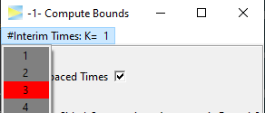
```
<br>

Hit `CALCULATE` to compute the 3-stage design.

```{r, out.width = "50%", fig.alt = "three-stage-result"}
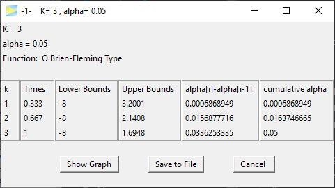
```

<br>

In the second to last column, you see how much alpha is spent at each stage,
while in the last column you see the cumulative alpha, which should sum up
to the overall significance level (here 5%).

Obviously, there are infinitely many ways to split the 5% over the three stages.
The default alpha spending strategy in GroupSeq is the O'Brien-Fleming type,
which is probably the most popular group sequential design in clinical trials.

As you see, the O'Brien-Fleming is very conservative at the early stages
of the study so that only 0.069% of alpha is spent at stage 1. The effect
therefore would have to be very large in order to exceed the critical
upper bound of 3.2 at stage 1 when 33% of the total sample will have been
collected.

To get a visual impression you can click the `Show Graph` button in the result
window which provides the following plot.

```{r, out.width = "50%", fig.alt = "three-stage-result-graph"}
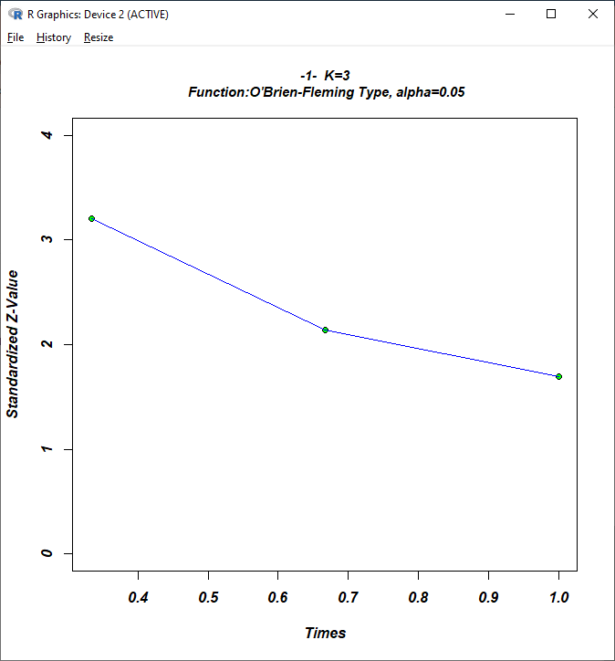
```

<br>
The advantage of this conservative strategy is that you still leave enough
alpha for the final analysis to reject `H0` for significant but moderate effects.

### Pocock 3-stage design

Another popular design, which actually had a significant positive impact on
the general popularity of group sequential designs in clinical research,
is the design by Pocock, which is constructed such the bounds are identical
at each stage. Let's select `(5) Exact Pocock Bounds` and hit `CONFIRM FUNCTION`.

```{r, out.width = "35%", echo = FALSE, fig.alt = "three-stage-pocock-bounds"}
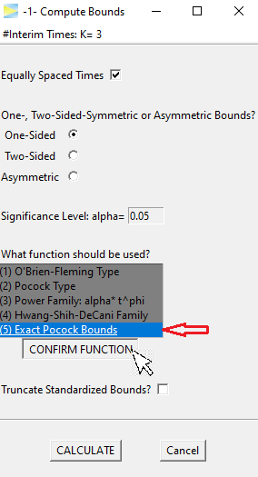
```

<br>
When hitting the `CALCULATE` button, this time we get the following.

```{r, out.width = c("55%", "40%"), echo = FALSE, fig.show="hold", fig.alt = "three-stage-pocock-results"}
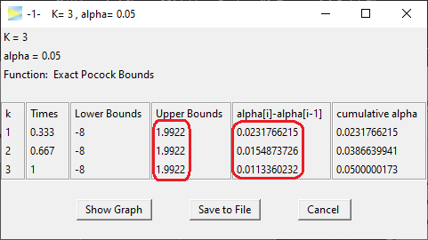
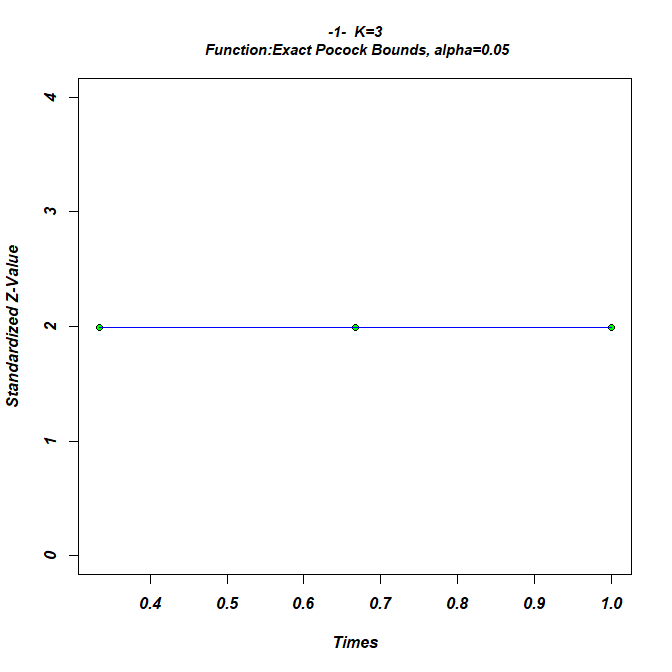
```

<br>
The resulting upper bounds are set constant over all stages at
1.99. Obviously this design is more aggressive than the O'Brien-Fleming design
in trying to abort early as 0.023% of alpha is already spent at the first
stage (see second to last column in above figure).

While the critical bounds are constant over all stages, the spent alpha is not.
Rather it is decreasing with each stage. This is "caused" by
the sample size, which is increasing on later stages, so that, roughly speaking,
it gets less likely under `H0` to produce a type I error.

### O'Brien-Fleming vs Pocock

When comparing the final stage of both designs, the spent alpha in the
O'Brien-Fleming design (0.034%) is roughly three times higher than in
the Pocock design (0.011%), which means that if the study is not aborted at
one of the interim analysis, once you reach the final stage the effect needs to
be much higher in the Pocock design to reject `H0` at the final stage.

Beside the statistical power there are other aspects such as
the expected sample size that can be taken into
consideration when comparing designs which however goes beyond the scope
of this vignette. This is also true with respect to the other available
designs^[To be exact, these are alpha spending functions, which lead to
certain types of designs.],
and it is recommended to consult the literature to study the properties
of the different designs.

You may have also noted that among the available design functions there is
`(2) Pocock type`, which is is very similar to option `(5) Exact Pocock Bounds`.
The `(2) Pocock type` is based on the alpha spending approach,
which always produces monotonously decreasing bounds and therefore does
not yield exact Pocock bounds by
definition. Since the Pocock design is very popular, the option of exact Pocock
bounds, which are slightly harder to compute, was added to GroupSeq.


### Non-equidistant interim times

To adjust interim times, which by default are equally spaced, the
correspondin checkmark has to be deselected.
```{r, out.width = "35%", echo = FALSE, fig.alt = "three-stage-pocock-custom-times"}
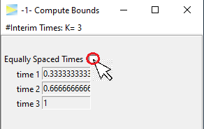
```

<br>
The times are entered manually, for example, lets start a bit later with the
first interim look.

```{r, out.width = "35%", echo = FALSE, fig.alt = "three-stage-pocock-custom-times"}
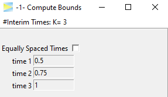
```

<br>
and `CALCULATE`.

```{r, out.width = "50%", echo = FALSE, fig.alt = "three-stage-pocock-custom-times-result"}
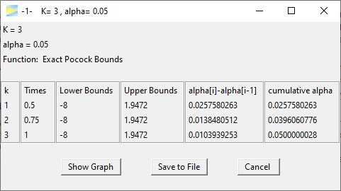
```

<br>
We see that this leads to slightly lower bounds, which seems about right as
this design is less aggressive to abort the study early.


### Two-Sided bounds

Last but not least, the designs can be calculated for the two-sided symmetric

```{r, out.width = "35%", echo = FALSE, fig.alt = "three-stage-pocock-two-side"}
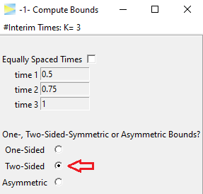
```

<br>
as well as the two-sided asymmetric case.

```{r, out.width = "35%", echo = FALSE, fig.alt = "three-stage-pocock-two-side-asym"}
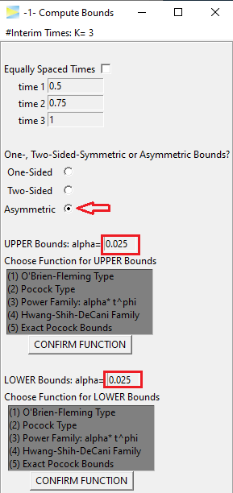
```

<br>
Naturally, the alpha is split up symmetrically, but can be customized if needed.
Also the alpha spending function has to be set separately for each side.
As an example, lets go with O'Brien-Fleming and Pocock again (don't forget to
hit the `CONFIRM FUNCTION` buttons).


```{r, out.width = c("55%", "40%"), echo = FALSE, fig.show="hold", fig.alt = "three-stage-pocock-two-side-asym-result"}
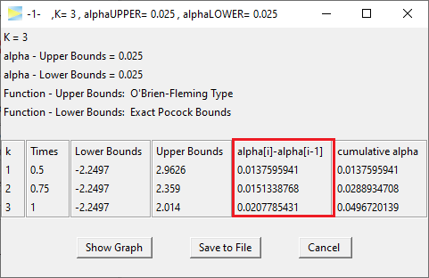
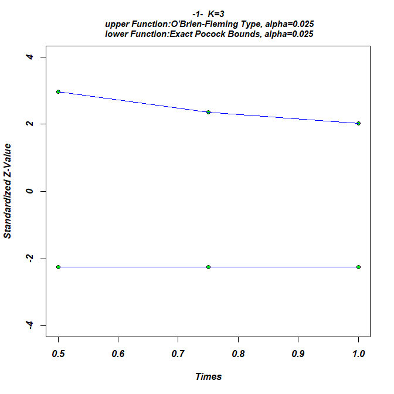
```

<br>
Looking at the stage-wise alpha spending, we literally end up with a mixture
of both designs as there is some alpha spend on the early stages but still
saved some for the last stage.

So this is mainly what can be done with GroupSeq to construct designs under `H0`.
Next lets see how to calculate probabilities under `H1` and specifically
to determine the effect size that is required to achieve a certain probability
(i.e. power) to detect an existing effect, which can be done via the second
menu option:
[-2- Compute Drift given Power and Bounds](https://rpahl.github.io/GroupSeq/articles/task-2-compute-drift.html)


```{r, include = FALSE}
options(old)
```


