```{r knitr-setup, include = FALSE}
library(knitr)
knitr::opts_chunk$set(
  comment = "#",
  prompt = F,
  tidy = FALSE,
  cache = FALSE,
  collapse = T,
  echo = FALSE,
  dpi = 300,
  fig.width = 5, fig.height = 5
)

old <- options(width = 100L, digits = 10)
```


This vignette builds right on
[-2- Compute Drift given Power and Bounds](https://rpahl.github.io/GroupSeq/articles/task-2-compute-drift.html)
so if you haven't seen the vignette it is recommended to visit this one first.

Taking forward the example from the last vignette, we want three stages of
manual bounds and enter a drift of `3.3553`.

```{r, out.width = "35%", echo = FALSE}
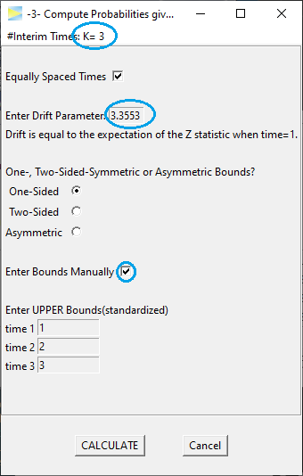
```

which `CALCULATE`s to

```{r, out.width = "50%"}
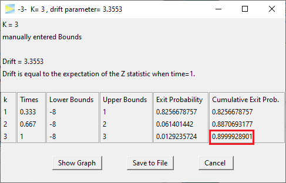
```

yielding about 90% of cumulative exit probability, which corresponds to the
study power assuming a standardized effect size of 3.3553. To see the type
I error of this design, that is, the probability under H0, we simply set the
drift to zero.

```{r, out.width = "35%"}
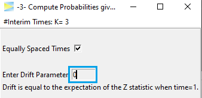
```

Re`CALCULATE` gives

```{r, out.width = "50%"}

```

thereby resulting in a type I error of about 16.3%, which clearly exceeds the
typically allowed level of 5%. As such the design is not valid.

To get closer to 5% we now could start adjusting the bounds bit by bit.
For example, as the design already spends 15.8% of alpha at stage 1, lets
increase the first stage bound to two.

```{r, out.width = c("40%", "55%"), echo = FALSE, fig.show = "hold"}
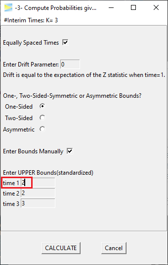
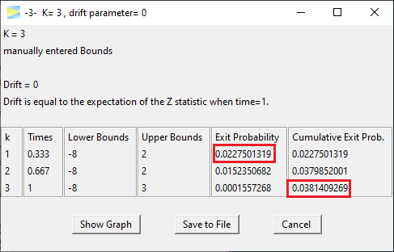
```

The type I error drops to about 3.8% so now we are a bit too conservative and
could further adjust. If we set the last bound to 2 as well, we actually end
up with a classic Pocock design.

```{r, out.width = c("40%", "55%"), echo = FALSE, fig.show = "hold"}
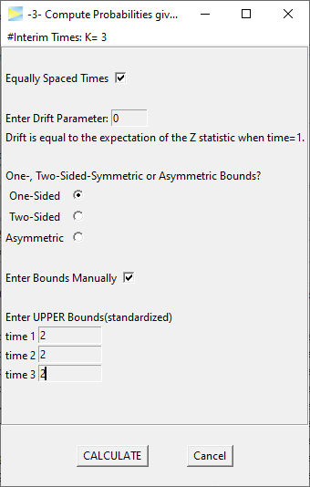
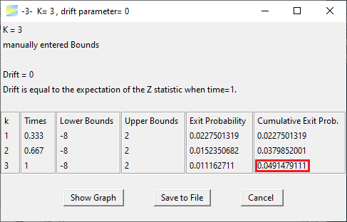
```

Very close already and of course the easiest way to get a Pocock design with
exactly 5% alpha level is to abort manual bounds and revert back to using
the corresponding function.

```{r, out.width = c("40%", "55%"), echo = FALSE, fig.show = "hold"}
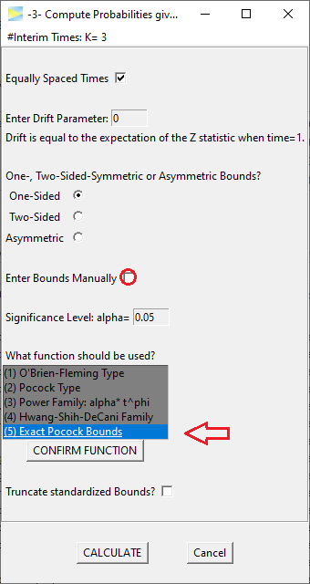
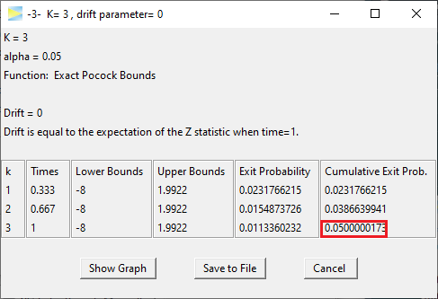
```

Last but not least lets calculate the power for this design, if the drift is 2,

```{r, out.width = c("40%", "55%"), echo = FALSE, fig.show = "hold"}
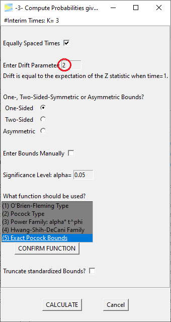
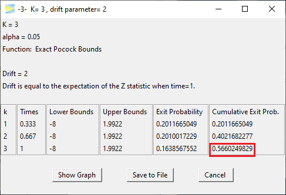
```

which apparently gives about 56.6%.

In the last vignette of this series we will see how to
[-4- Compute Confidence Interval](https://rpahl.github.io/GroupSeq/articles/task-4-compute-CI.html)s
at the final stage of a group sequential study.


```{r, include = FALSE}
options(old)
```
