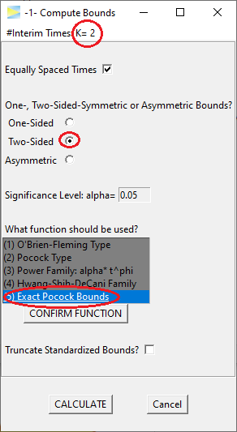
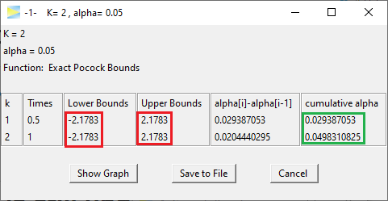
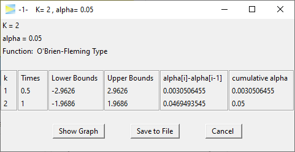

```{r knitr-setup, include = FALSE}
library(knitr)
library("ggplot2")

knitr::opts_chunk$set(
  comment = "#",
  prompt = F,
  tidy = FALSE,
  cache = FALSE,
  collapse = T,
  echo = FALSE,
  dpi = 300,
  fig.width = 5, fig.height = 5
)

okabe_palette <- c('orange' = "#E69F00",
                   'sky blue' = "#56B4E9",
                   'bluish green' = "#009E73",
                   'yellow' = "#F0E442",
                   'blue' = "#0072B2",
                   'vermillion' = "#D55E00",
                   'reddish purple' = "#CC79A7")

options(width = 100L, digits = 10)
```


While calculating probabilities of group sequential designs can be considered
somewhat complex, it may be less difficult than most people think. This vignette
provides a visual explanation of the underlying method to help forming 
an intuitive understanding of this topic.
The author is convinced that gaining an intuitive understanding of these 
calculations helps when applying and interpreting such designs in practice.

### One-sample study
Following the easy-to-hard principle, we start with conventional non-sequential
study designs and gradually progress to the group sequential case.

Consider you have a sample of data, let's call it `X1`.

```{r}
fill_colors = c(X1 = okabe_palette[["bluish green"]],
                X2 = okabe_palette[["vermillion"]],
                "X1+X2" = "#6B7E3A")

data  = data.frame(x = c(1:10, 1:10, 1:20),
                   y = c(rep(2, 10), rep(1.5, 10), rep(1.5, 20)),
                   Sample = c(rep("X1", 10), rep("X2", 10), rep("X1+X2", 20))
)
```


```{r, out.width = "35%", message = FALSE, fig.height = 1, fig.width = 2.5, fig.align = "center", fig.cap = "Schematic view of a study sample - each circle represents some measurement."}
dat = data[1:10, ]
ggplot(dat, aes(x = x, y = y)) +
    geom_point(size = 10, shape = 21, aes(fill = Sample)) +
    scale_fill_manual(values = fill_colors[1]) +
    lims(y = c(2, 2)) +
    theme_void() +
    theme(legend.position = "bottom")

```
<br>
Usually some standardized test statistic is calculated and, 
assuming standard normally distributed data, the density distribution under the 
null hypothesis forms the well-known bell-shaped curve.

```{r, echo = FALSE, out.width = "65%", fig.cap = fig.cap, fig.height=3}
fig.cap = "Standard Normal Density with critial bounds marking 5% significance level."

blue = okabe_palette[["sky blue"]]
yellow = okabe_palette[["yellow"]]


crit = qnorm(1 - 0.025)
probLabel = paste0(pnorm(-crit)*100, "%")
x = seq(-3, 3, by = 0.01)

normalDensPlot = 
    ggplot(data.frame(x = x), aes(x = x)) +
    stat_function(fun = dnorm, geom = "area", fill = blue, xlim = c(-4, -crit)) +
    stat_function(fun = dnorm, geom = "area", fill = yellow, xlim = c(-crit, crit)) +
    stat_function(fun = dnorm, geom = "area", fill = blue, xlim = c(crit, 4)) +
    stat_function(fun = dnorm, color = okabe_palette[["bluish green"]], size = 1.5) +
    geom_segment(x = 2.2, xend = 2.7, y = 0.02, yend = 0.07) +
    geom_segment(x = -2.2, xend = -2.7, y = 0.02, yend = 0.07) +
    annotate("text", label = probLabel, x = 2.9, y = 0.09, size = 3.5) +
    annotate("text", label = probLabel, x = -2.9, y = 0.09, size = 3.5) +
    lims(x = range(x)) +
    labs(x = expression(x[1]), 
         y = expression(f(x[1]))) +
    theme_minimal() +
    theme(panel.grid.major = element_blank(),
          panel.grid.minor = element_blank(),
          axis.ticks.x = element_line())

normalDensPlot
```

<br>
If a two-sided test is planned with a significance level of $\alpha = 5\%$, 
the critical bounds are set as visualized in the above figure. 
In the days before computers these bounds had to be looked up in tables in some
book, but these days of course you just plug-in the numbers in your favorite
statistics program. In R its
```{r, echo = TRUE}
qnorm(0.025)
```

Now what do these bounds mean? Basically, if the null
hypothesis ($H_0$) was true, the probability of obtaining a test statistic at or
beyond these bounds is $2\cdot 0.025 = 0.05$, which therefore 
limits the so-called type I error (rejecting $H_0$ although its true) at 5%.

Going forward the key thing to note here is that calculating this probability 
basically means *calculating the (blue) area under the density curve* (see above
figure). Again, these days it's easy to derive the area using computer's 
numerical integration.


### Combining two studies

Now lets consider another sample `X2` that was collected independently from `X1`.


```{r, out.width = "35%", message = FALSE, fig.height = 1.3, fig.width = 2.5, fig.align = "center"}
dat = data[1:20, ]
ggplot(dat, aes(x = x, y = y)) +
    geom_point(size = 10, shape = 21, aes(fill = Sample)) +
    scale_fill_manual(values = fill_colors[1:2]) +
    lims(y = c(1.2, 2.2)) +
    theme_void() +
    theme(legend.position = "bottom")

```

<br>
If we construct a distribution similar to the one above, we have the following.

```{r, fig.width = 8, fig.height = 3, out.width = "85%"}
normalDensPlotX2 = normalDensPlot + 
    labs(x = expression(x[2]), y = expression(f(x[2]))) +
    stat_function(fun = dnorm, color = okabe_palette[["vermillion"]], size = 1.5)
gridExtra::grid.arrange(normalDensPlot, normalDensPlotX2, nrow = 1)
```

<br>
A statistical test on both samples now would control the type I error for each of 
these studies at the 5% level, but, of course, things are more complicated
if you consider both samples at the same time, because now you have two chances
of conducting the type I error.

So if we assume our samples `X1` and `X2` were sampled from
the same population and we are interested to test the same outcome,
to control the *overall* type I error still at 5% we need to down-adjust alpha.
The simplest and most common approach is to use the Bonferroni correction,
which means we are allowed to spend $\alpha_{Bonf} = \alpha/2 = 0.025$.
The corresponding adjusted critical bound is 
```{r, echo = TRUE}
qnorm(0.025/2)
```
and we have

```{r, echo = FALSE, out.width = "65%", fig.cap = fig.cap, fig.height=3}
fig.cap = "Standard Normal Density with critial bounds marking 5% significance level."

blue = okabe_palette[["sky blue"]]
yellow = okabe_palette[["yellow"]]

crit = qnorm(1 - 0.025/2)
probLabel = paste0(pnorm(-crit)*100, "%")
x = seq(-3, 3, by = 0.01)

normalDensPlotAdj = 
    ggplot(data.frame(x = x), aes(x = x)) +
    stat_function(fun = dnorm, geom = "area", fill = blue, xlim = c(-4, -crit)) +
    stat_function(fun = dnorm, geom = "area", fill = yellow, xlim = c(-crit, crit)) +
    stat_function(fun = dnorm, geom = "area", fill = blue, xlim = c(crit, 4)) +
    stat_function(fun = dnorm, color = okabe_palette[["bluish green"]], size = 1.2) +
    geom_segment(x = 2.2+.2, xend = 2.7+.2, y = 0.02, yend = 0.07) +
    geom_segment(x = -2.2-.2, xend = -2.7-.2, y = 0.02, yend = 0.07) +
    annotate("text", label = probLabel, x = 2.9, y = 0.09, size = 3.5) +
    annotate("text", label = probLabel, x = -2.9, y = 0.09, size = 3.5) +
    lims(x = range(x)) +
    labs(x = expression(x[1]), 
         y = expression(f(x[1]))) +
    theme_minimal() +
    theme(panel.grid.major = element_blank(),
          panel.grid.minor = element_blank(),
          axis.ticks.x = element_line())
```

```{r, fig.width = 8, fig.height = 3, out.width = "85%"}
normalDensPlotX2Adj = normalDensPlotAdj + 
    labs(x = expression(x[2]), y = expression(f(x[2]))) +
    stat_function(fun = dnorm, color = okabe_palette[["vermillion"]], size = 1.5)
gridExtra::grid.arrange(normalDensPlotAdj, normalDensPlotX2Adj, nrow = 1)
```


```{r}
alpha = 0.05
alpha.Bonf = alpha / 2
alpha.Sidak = 1 - (1-alpha)^(1/2)

crit.Bonf = -rep(qnorm(alpha.Bonf / 2), 2)
crit.Sidak = -rep(qnorm(alpha.Sidak / 2), 2)
```
So if we calculate the overall type I error probability, we sum up all the areas
and get $p = 1.25\% + 1.25\%+ 1.25\% + 1.25\% = 5\%$.
So we are good, are we? Well, the devil is in the details. 

Remember, the goal was to make
sure that we don't conduct a type I error. The probability to conduct *no*
type I at either `X1` or `X2` is $p = 1-\alpha_{Bonf} = 1-0.025 = 0.975$. 

From this it
follows that the probability to conduct no error at both `X1` and `X2` is
$(1-\alpha_{Bonf})^2 = 0.950625$. 

Now we can calculate the complementary probability
of conducting *at least one* type I error as 
$p = 1 - (1-\alpha_{Bonf})^2 = 0.049375 = 4.9\%$. Wait, why is it not 5%? 
Well, the reason
is that we don't care if one or both studies produce a type I error, as one
error is already enough for the overall setup to fail. As a result, the
Bonferroni correction is not optimal, as it "wastes" 0.1% of alpha. 

<br>
Of course, this is well-known and a precise alpha adjustment can be derived via 
the so-called
[Sidak correction](https://en.wikipedia.org/wiki/%C5%A0id%C3%A1k_correction):
$\alpha_{Sidak} = 1 - (1-\alpha)^{1/2} = 0.02532057 > \alpha_{Bonf}$.

Plugging this into the above formula, we get
$p = 1 - (1-\alpha_{Sidak})^2 = 0.05 = 5\%$. 
If you are interested, you can find the
derivation of [Sidak's](https://en.wikipedia.org/wiki/%C5%A0id%C3%A1k_correction) formula
under the link, but I have promised you to provide intuitive explanations,
so let's move to the key concept that will also help to understand group 
sequential probabilities.


### Combining two distributions

If we want to combine both studies, it makes sense to combine the two
density distributions into a two-dimensional (aka bivariate) normal distribution, 
which then looks like this.

```{r prepare-2D-normal-density-plot, echo = FALSE, include = FALSE}
mu = 0
Mean = c(mu, mu)
covariance = 0
Sigma0 = matrix(c(1, rep(covariance, 2), 1), 2)


width = 6.6
binwidth = 0.2
x1 = x2 = seq(from = mu - width/2, to = mu + width/2, by = binwidth)
grid = expand.grid(x1, x2)

z = mvtnorm::dmvnorm(grid, mean = Mean, sigma = Sigma0)
zmat = matrix(z, ncol = length(x1))

grid.col = expand.grid(x1[-1] - binwidth/2, x2[-1] - binwidth/2)
gc1 = grid.col[, 1]
gc2 = grid.col[, 2]

crit = crit.Sidak
get_color = Vectorize(function(x1, x2) {
    if (x1 < -crit[1] || x1 > crit[1] || x2 < -crit[2] || x2 > crit[2])
        blue else yellow
})

plot_normal_dens_2d = function(zmat, ...) {
    persp(x1, x2, zmat,
          expand = 0.5,
          lphi = 0,
          xlab = "x1",
          ylab = "x2\n",
          zlab = "f(x1, x2)",
          shade = 0.2,
          ticktype = "detailed",
          ...)
}
```


```{r, out.width = "55%"}
op = par(mar = c(0, 2, 0, 0))
plot_normal_dens_2d(zmat, phi = 45, col = get_color(gc1, gc2))
par(op)
```

Remember that determining the probability of distributions is all about
doing numerical integration under the curve, that is, the overall type I error 
now is derived by computing the volume under the blue area. To do this, we 
are using the
[mvtnorm](https://CRAN.R-project.org/package=mvtnorm) package.^[To keep matters simple,
we just discuss the results, but if you want to see the actual R commands,
just inspect the source code of this vignette.]


```{r, include = FALSE}
crit.Bonf = -rep(qnorm(alpha.Bonf / 2), 2)
crit.Sidak = -rep(qnorm(alpha.Sidak / 2), 2)

crit = crit.Bonf
crit = crit.Sidak

calc2Dprob = function(crit, sigma) {
    calc_prob = function(lower, upper) {
        as.numeric(mvtnorm::pmvnorm(lower = lower, upper = upper, sigma = sigma))
    }
        
    left_stripe = calc_prob(lower = c(-Inf, -Inf), upper = c(-crit[1], Inf))
    lower_rectangle = calc_prob(lower = c(-crit[1], -Inf), upper = c(crit[1], -crit[2]))
    2 * left_stripe + 2 * lower_rectangle # return two-sided prob
}

p.edge = as.numeric(mvtnorm::pmvnorm(lower = c(-Inf, -Inf), 
                                     upper = c(-crit[1], -crit[2]), 
                                     sigma = Sigma0))


p2D.Bonf = calc2Dprob(crit.Bonf, sigma = Sigma0)
p2D.Sidak = calc2Dprob(crit.Sidak, sigma = Sigma0)
```

If we plug in the Bonferroni bounds (`r round(crit.Bonf[1], 4)`) in each dimension and 
calculate the probability for the blue
area, we get p = `r p2D.Bonf` while the Sidak bounds (`r round(crit.Sidak[1], 4)`)
yield p = `r p2D.Sidak`,
which matches our results from above.

However, we now also have a graphical intuitive interpretation to explain the
results. For this, have a look at the next graph.

```{r, out.width = "55%"}
orange = okabe_palette[["orange"]]
crit = crit.Sidak
get_color_edges = Vectorize(function(x1, x2) {
    # Make edges grey
    if (x1 < -crit[1] && x2 < -crit[2] ||
        x1 < -crit[1] && x2 >  crit[2] ||
        x1 >  crit[1] && x2 < -crit[2] ||
        x1 >  crit[1] && x2 >  crit[2])
        return("grey")
    
    if (x1 < -crit[1] || x1 > crit[1] || x2 < -crit[2] || x2 > crit[2])
        blue else yellow
})

op = par(mar = c(0, 2, 0, 0))
plot_normal_dens_2d(zmat, phi = 45, col = get_color_edges(gc1, gc2))
par(op)
```


The grey areas basically mark those scenarios where the type I errors of both
samples fall together.
The intuitive explanation now goes like this: when calculating the overall 
probability using the two-dimensional normal distribution, 
the grey areas are only counted once whereas in the one-dimensional Bonferroni 
case you count them twice. To see this, we can calculate the probability
for one of these edges,
which is p = 0.00016, and if we subtract them from the overall alpha
we get $p = 0.05 - 4\cdot 0.00016 = 0.04936$, which corresponds to the overall 
probability under Bonferroni correction as we saw above.

So when using the two-dimensional normal distribution, we naturally derive at the
optimal solution for the alpha adjustment. The same is true for group sequential
designs, which further optimize the calculation by taking into account
the dependency of the staged samples.


### Group sequential study

In a (group) sequential study design, samples are analyzed in a sequence
where at each stage all the data from earlier stages are combined with the
data of the current stage.

```{r, out.width = "35%", message = FALSE, fig.height = 1.3, fig.width = 2.5, fig.align = "center", fig.cap = "Schematic view of group sequential two-stage study."}
dat = data[c(1:10, 21:40), ]

ggplot(dat, aes(x = x, y = y)) +
    geom_point(size = 10, shape = 21, aes(fill = Sample)) +
    scale_fill_manual(values = fill_colors[c(1, 3)]) +
    lims(y = c(1.2, 2.2)) +
    theme_void() +
    theme(legend.position = "bottom")

```

The crucial difference when combining the samples in this way is that now they
are inherently dependent, that is, the statistic of sample `X1 + X2` will be 
correlated to the that of sample `X1`.

The naive approach for the alpha adjustment again would be to treat both
density distributions as independent and apply the Bonferroni correction.

```{r, fig.width = 8, fig.height = 3, out.width = "85%", fig.cap = "Normal densities for stage 1 and 2 with Bonferroni bounds."}
normalDensPlotX2Adj = normalDensPlotAdj + 
    labs(x = expression(x[2]), y = expression(f(x[2]))) +
    stat_function(fun = dnorm, color = fill_colors[3], size = 1.5)
gridExtra::grid.arrange(normalDensPlotAdj, normalDensPlotX2Adj, nrow = 1)
```

Since this completely ignores the correlation, we expect that even more alpha
is wasted. To see this let's now again use the two-dimensional distribution.

```{r}
mu = 0
Mean = c(mu, mu)
covariance = sqrt(0.5)
Sigma = matrix(c(1, rep(covariance, 2), 1), 2)

z = mvtnorm::dmvnorm(grid, mean = Mean, sigma = Sigma)
zmat = matrix(z, ncol = length(x1))
```


```{r, fig.show="hold", out.width = "30%", fig.cap = "Bivariate normal density of two-stage design viewed from different angles."}
op = par(mar = rep(.1, 4))
plot_normal_dens_2d(zmat, phi = 40, col = get_color(gc1, gc2), box = FALSE)
plot_normal_dens_2d(zmat, phi = 65, col = get_color(gc1, gc2), box = FALSE)
plot_normal_dens_2d(zmat, phi = 90, col = get_color(gc1, gc2), box = FALSE)
par(op)
```

We again omit the details on how to derive the distribution, but as you can see,
the correlation leads to a flattened bell curve, which in the independent case
before was perfectly symmetrical. Also the amount of correlation is proportional 
to the data overlap of the stages. For example, if the first stage used 5 instead
of the 10 data points, the stages would be less correlated and therefore the
bell curve less flattened.

```{r}
p2D.Bonf = calc2Dprob(crit.Bonf, sigma = Sigma)
```

Based on this distribution, the Bonferroni bounds (`r round(crit.Bonf[1], 2)`)
now yield p = `r round(p2D.Bonf, 3)` so that for this group sequential study
`r round((0.05 - p2D.Bonf)*100, 1)`% of alpha would be "wasted".

Intuitively, the flattened curve has pulled some mass into the middle leaving
less volume under the blue area. 

#### Pocock design

The idea of group sequential designs obviously is to come up with bounds that
lead to overall 5% type I error. Let's start with so-called Pocock bounds,
which means we want equal bounds at all stages. Using the GroupSeq package,
these can be derived as follows.

```{r, out.width = "40%", echo = FALSE}

```

```{r, out.width = "70%", echo = FALSE}

```


```{r}
crit.Pocock = rep(2.1783, 2)
p2D.Pocock = calc2Dprob(crit.Pocock, sigma = Sigma)
```

So the Pocock bounds are `r crit.Pocock[1]` and thus as expected lower than the 
Bonferroni bounds. The last entry in the 'cumulative alpha' column shows 
the overall alpha, which is close to 5%.^[In fact, it is
closer to 5% (`r p2D.Pocock`) than shown in the GroupSeq application, 
which stems from the 
fact that the GroupSeq legacy version uses a different more rudimentary
numerical integration algorithm.]

Inspecting the probabilities stage by stage, 2.93% of alpha is spent at the first 
and 2.04% at the second stage, respectively. That is, although the nominal bounds
are identical at both stages, due to the asymmetric shape of the two-dimensional
distribution, the resulting probabilities are different.

The graphical presentation of group sequential designs normally is done with
a graph showing at the x-axis the "Information Rate", which marks the relative 
sample size of the respective stages, and the nominal bounds at the y-axis.
The above Pocock design thus looks something like this.

```{r, echo = FALSE, out.width = "50%", fig.cap = "Group sequential 2-stage Pocock design with one interim look at half of the total samples."}
n = 100
tt = c(.5, 1)
crit = crit.Pocock
x = seq(0.2, 1.0, length = n)

upperLine = data.frame(x = x, y = crit[1])
lowerLine = data.frame(x = x, y = -crit[1])

upperArea = data.frame(x = x, ymin = upperLine$y, ymax = 3, y = 3)
innerArea = data.frame(x = x, ymin = lowerLine$y, ymax = upperLine$y, y = 0)
lowerArea = data.frame(x = x, ymin = -3, ymax = lowerLine$y, y = -3)

p = ggplot(mapping = aes(x = x, y = y)) +

    geom_ribbon(data = upperArea, aes(x = x, ymin = ymin, ymax = ymax, y = y), fill = blue) +
    geom_ribbon(data = innerArea, aes(x = x, ymin = ymin, ymax = ymax, y = y), fill = yellow) +
    geom_ribbon(data = lowerArea, aes(x = x, ymin = ymin, ymax = ymax, y = y), fill = blue) +

    geom_line(data = upperLine) +
    geom_line(data = lowerLine) +

    geom_point(data = data.frame(x = tt, y =  crit), size = 5, shape = 21, fill = fill_colors[c(1, 3)]) +
    geom_point(data = data.frame(x = tt, y = -crit), size = 5, shape = 21, fill = fill_colors[c(1, 3)]) +

    theme_minimal() +
    labs(x = "Information Rate", y = "Critical Value") +
    lims(y = c(-3, 3)) +
    theme(panel.grid.major = element_blank(),
          panel.grid.minor = element_blank(),
          axis.ticks.x = element_line())

p
```

#### O'Brien-Fleming design

Probably the most popular group sequential design is the O'Brien-Fleming design.
For our two-stage scenario with half of the sample used in each stage,
it looks like this.

```{r, echo = FALSE, out.width = "50%", fig.cap = "Group sequential 2-stage O'Brien-Fleming design with one interim look at 0.5."}

asOBF <- function(t, alpha = 0.05, side = 2) {
  2 * (1 - stats::pnorm((stats::qnorm(1 - (alpha / side)/2)) / sqrt(t)))
}

n = 100
tt = c(.5, 1)

crit.OBF = -qnorm(asOBF(tt))
crit = crit.OBF
x = seq(0.2, 1.0, length = n)

upperLine = data.frame(x = x, y = -qnorm(asOBF(x)))
lowerLine = data.frame(x = x, y = qnorm(asOBF(x)))

upperArea = data.frame(x = x, ymin = upperLine$y, ymax = 6, y = 3)
innerArea = data.frame(x = x, ymin = lowerLine$y, ymax = upperLine$y, y = 0)
lowerArea = data.frame(x = x, ymin = -6, ymax = lowerLine$y, y = -3)

p = ggplot(mapping = aes(x = x, y = y)) +

    geom_ribbon(data = upperArea, aes(x = x, ymin = ymin, ymax = ymax, y = y), fill = blue) +
    geom_ribbon(data = innerArea, aes(x = x, ymin = ymin, ymax = ymax, y = y), fill = yellow) +
    geom_ribbon(data = lowerArea, aes(x = x, ymin = ymin, ymax = ymax, y = y), fill = blue) +

    geom_line(data = upperLine) +
    geom_line(data = lowerLine) +

    geom_point(data = data.frame(x = tt, y =  crit), size = 5, shape = 21, fill = fill_colors[c(1, 3)]) +
    geom_point(data = data.frame(x = tt, y = -crit), size = 5, shape = 21, fill = fill_colors[c(1, 3)]) +

    theme_minimal() +
    labs(x = "Information Rate", y = "Critical Value") +
    lims(y = c(-6, 6)) +
    theme(panel.grid.major = element_blank(),
          panel.grid.minor = element_blank(),
          axis.ticks.x = element_line())

p

```

The numbers are outlined below.

```{r, out.width = "70%", echo = FALSE}

```

Clearly the critical bounds at stage one are very conservative so that 
only 0.3% of alpha is spent there. With spending 4.7% of alpha at the last
stage this O'Brien-Fleming design in fact is not
much different to a standard single stage study, which spends all the 5% on the 
full sample. Basically, the first stage is kind of a shot
in the dark to allow catching really big effects.

In contrast, the Pocock design appears to be more "aggressive" trying harder to
terminate the study early. Of course, the drawback of the Pocock strategy is
that if the study cannot be terminated after the first stage, it then only
has about 2% of alpha left for the final stage.

To apply the O'Brien-Fleming design more aggressively, one could plan the first
stage analysis at a later time point. For example, having the first interim
analysis after 70% of the samples already means that about 1.5% of alpha are
spent at stage 1.


#### Design comparisons

To strengthen our intuitive understanding, let's compare the Pocock and 
O'Brien-Fleming design in the two-dimensional density view.

```{r, fig.show="hold", out.width = "45%", fig.cap = "Bivariate normal density with critical bounds of Pocock (left) and O'Brien-Fleming design (right) both with interim analysis after 50% of the sample."}
op = par(mar = rep(1.5, 4))
crit = crit.Pocock
plot_normal_dens_2d(zmat, phi = 80, col = get_color(gc1, gc2))
crit = crit.OBF
plot_normal_dens_2d(zmat, phi = 80, col = get_color(gc1, gc2))
par(op)
```

The figure below shows how the time point of the stage 1 analysis affects the
correlation of the stages and with that shapes the design probabilities.

```{r, fig.show="hold", out.width = "30%", fig.cap = "Bivariate normal density of two-stage O'Brien-Fleming design with first stage after 50% (left), 70% (middle) and 90% (right) of all samples."}

crit = crit.OBF
mu = 0
Mean = c(mu, mu)

Sigma = matrix(c(1, rep(sqrt(0.5), 2), 1), 2)
z = mvtnorm::dmvnorm(grid, mean = Mean, sigma = Sigma)
zmat0.5 = matrix(z, ncol = length(x1))

Sigma = matrix(c(1, rep(sqrt(0.7), 2), 1), 2)
z = mvtnorm::dmvnorm(grid, mean = Mean, sigma = Sigma)
zmat0.7 = matrix(z, ncol = length(x1))

Sigma = matrix(c(1, rep(sqrt(0.9), 2), 1), 2)
z = mvtnorm::dmvnorm(grid, mean = Mean, sigma = Sigma)
zmat0.9 = matrix(z, ncol = length(x1))


op = par(mar = rep(.1, 4))
plot_normal_dens_2d(zmat0.5, phi = 90, col = get_color(gc1, gc2), box = FALSE)
plot_normal_dens_2d(zmat0.7, phi = 90, col = get_color(gc1, gc2), box = FALSE)
plot_normal_dens_2d(zmat0.9, phi = 90, col = get_color(gc1, gc2), box = FALSE)
par(op)
```


